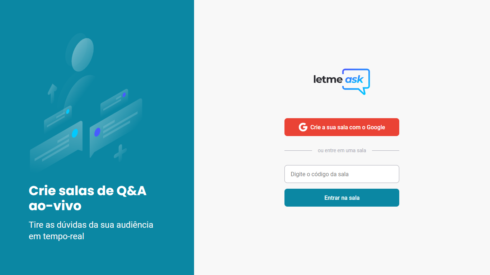

<p align="center">
  
</p>

<p align="center">
  

     
</p>

<h1 align="center">
    
</h1>

## 🧪 Tecnologias

Esse projeto foi desenvolvido com as seguintes tecnologias:

- [React](https://reactjs.org)
- [Firebase](https://firebase.google.com/)
- [TypeScript](https://www.typescriptlang.org/)

## 🚀 Como executar

Clone o projeto e acesse a pasta do mesmo.

```bash
$ git clone https://github.com/xpedroleonardo/LetmeAsk.git

$ cd LetmeAsk
```

Para iniciá-lo, siga os passos abaixo:

```bash
# Instalar as dependências
$ yarn

# Iniciar o projeto
$ yarn start
```

O app estará disponível no seu browser pelo endereço http://localhost:3000.

Lembrando que será necessário criar uma conta no [Firebase](https://firebase.google.com/) e um projeto para disponibilizar um Realtime Database.
É necessário também alterar criar um arquivo com o nome ".env.local", na raiz do projeto, para colocar as suas credenciais de acesso do Firebase.

## 💻 Projeto

Letmeask é perfeito para criadores de conteúdos poderem criar salas de Q&A com o seu público, de uma forma muito organizada e democrática.

## 📑 Desafios (Em andamento)

- [ ] Responsividade

- [ ] Tema Dark

- [ ] Styled Components

- [ ] PWA

## 📝 License

Esse projeto está sob a licença MIT. Veja o arquivo [LICENSE](LICENSE.md) para mais detalhes.

---

Feito com 💜 by [Pedro Leonrardo](https://github.com/xpedroleonardo)
